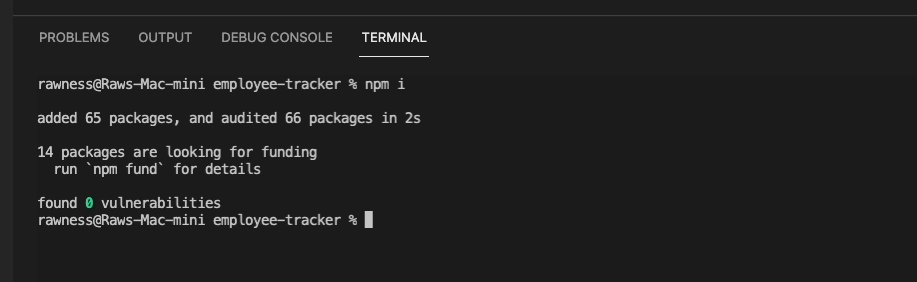
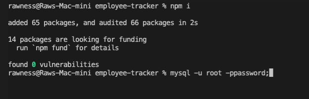
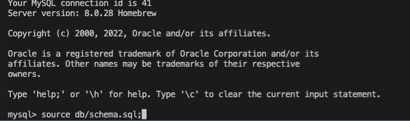
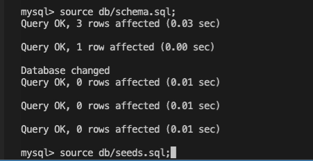
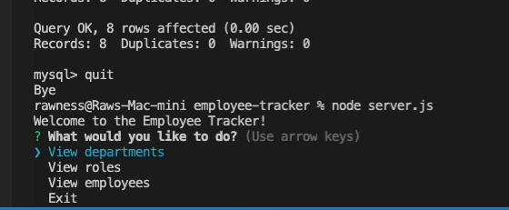
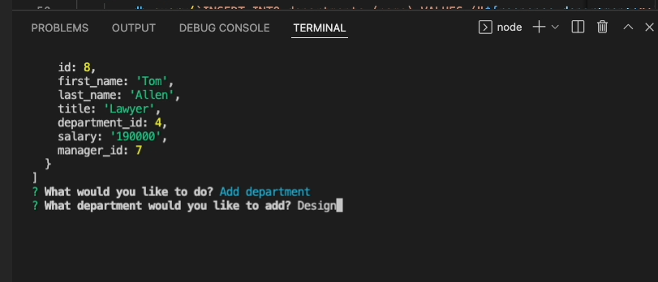
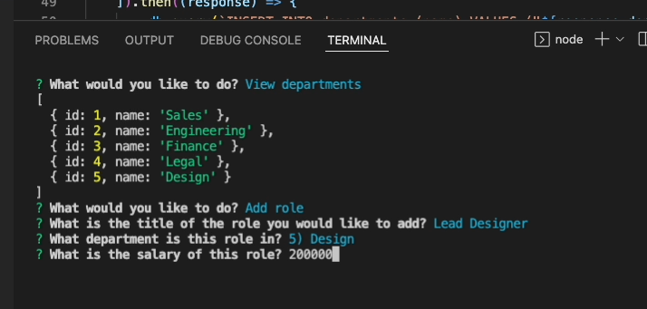
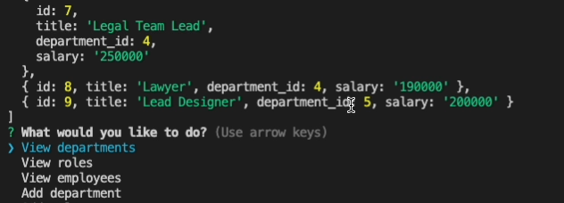

### About Employee Tracker

Click the GIF to watch a video on the installation and use of Employee Tracker:

Table of Contents

  <ol>
    <li><a href="#description">Description</a></li>
    <li><a href="#built-with">Built With</a></li>
    <li><a href="#installation">Installation</a></li>
    <li><a href="#usage">Usage</a></li>
    <li><a href="#future-updates">Future Updates</a></li>
  </ol>

## Description

Employee Tracker allows you to access an employee database, view various tables within it, and add departments and roles.

## Built With

This application was built with MySQL2, Inquirer, NodeJS, and JavaScript.

## Installation

Node.js installation is required. After cloning this repository, open the folder containing the server.js file in your command line application. Then run `npm i`. This will install inquirer and mysql2.

Log into MySQL. 

Run db/schema.sql 

and then db/seeds.sql.

This will create the employees database and seed it with values.

## Usage

After quitting MySQL, run the command line 'node server.js'. You will see a message greeting you and present you with four choices. The first three will allow you to view specific tables. Use the arrows keys to select and enter to choose. After viewing a table, you will be asked again what you would like to do. Choosing the last option will exit you out of the application.

You can also add a department of your choosing. Select the 'Add Department' option and provide a response. That should now show up when doing 'View Departments'.

You can also add a role. Choosing this option will ask for a role title, department, and salary.

You can see the newly added role with the newly added department (Design with the department_id 5) when we 'View Roles'.

## Future Updates

<ul>
  <li>'Add Employee' option</li>
  <li>Update manager ID's to include their names</li>
</ul>

